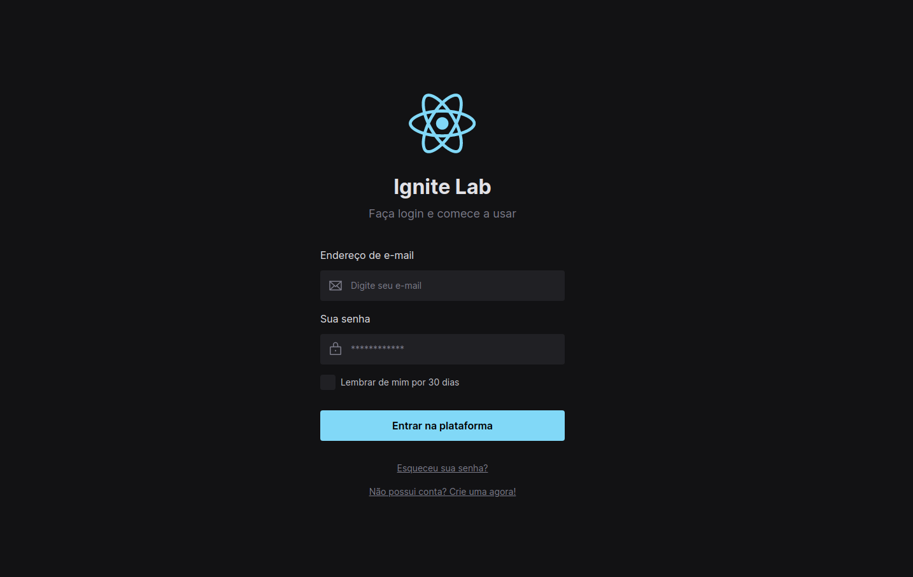

<h1 align="center">Ignite Lab 03 - Design System 🎨</h1>

<div align="center">

</div>

### 💻 Descrição 
<p align="justify">Projeto desenvolvido durante a terceira edição do Ignite Lab com foco em Design System.</p>

👉 Acesse o Design no [Figma](https://www.figma.com/file/HMfRDJktCuyPIHrpm0OWk1/Ignite-Lab?node-id=1%3A179)

### :nut_and_bolt: Tecnologias

Esse projeto foi desenvolvido com as seguintes tecnologias:

- [Javascript][javascript]
- [TypeScript][typescript]
- [React][reactjs]
- [Storybook][storybook]
- [Radix][radix]
- [Phosphor-icons][phosphor-icons]
- [Tailwindcss][tailwindcss]
- [Vite][vite]
  
[javascript]: https://developer.mozilla.org/pt-BR/docs/Web/JavaScript
[typescript]: https://www.typescriptlang.org/
[reactjs]: https://reactjs.org
[storybook]: https://storybook.js.org/
[radix]: https://www.radix-ui.com/docs/primitives/overview/introduction
[phosphor-icons]: https://phosphoricons.com/
[TailwindCSS]: https://tailwindcss.com/
[vite]: https://vitejs.dev/


### 🤔 Como rodar o projeto? 

```bash
# Clone o repositório
git clone https://github.com/Gabriek0/lab-ds.git

# Mude para o diretório do projeto
cd https://github.com/Gabriek0/lab-ds.git

# Instale as dependências
yarn

# Rode o projeto
yarn dev
```

### 🧑 Autor do Projeto

<table>
  <tr>
    <td align="center">
      <a href="https://github.com/Gabriek0">
        
        <br />
          <sub>
            <b>Gabriel Henrique</b>
          </sub>
      </a>
    </td>

  </tr>
</table>


